# FastAPI Api Key

`keyshield` provides a backend-agnostic library that provides a production-ready, secure API key system, with optional FastAPI and Typer connectors.

## Links

- **Documentation:** [https://athroniaeth.github.io/keyshield/](https://athroniaeth.github.io/keyshield/)
- **PyPI package:** [https://pypi.org/project/keyshield/](https://pypi.org/project/keyshield/)

## Features

- **Security-first**: secrets are hashed with a salt and a pepper, and never logged or returned after creation
- **Prod-ready**: services and repositories are async, and battle-tested
- **Agnostic hasher**: choose between Argon2 (default) or Bcrypt hashing strategies (with caching support)
- **Agnostic backend**: abstract repository pattern, currently with SQLAlchemy implementation
- **Connectors**: FastAPI router and Typer CLI for API key management
- **Envvar support**: easily configure peppers and other secrets via environment variables
- **Scopes support**: assign scopes to API keys for fine-grained access control

## Standards compliance

This library try to follow best practices and relevant RFCs for API key management and authentication:

- **[RFC 9110/7235](https://www.rfc-editor.org/rfc/rfc9110.html)**: Router raise 401 for missing/invalid keys, 403 for
  valid but inactive/expired keys
- **[RFC 6750](https://datatracker.ietf.org/doc/html/rfc6750)**: Supports `Authorization: Bearer <api_key>` header for
  key transmission (also supports deprecated `X-API-Key` header and `api_key` query param)

## How API Keys Work

### API Key Format

This is a classic API key if you don't modify the service behavior:

**Structure:**

`{global_prefix}`-`{separator}`-`{key_id}`-`{separator}`-`{key_secret}`

**Example:**

`ak-7a74caa323a5410d-mAfP3l6yAxqFz0FV2LOhu2tPCqL66lQnj3Ubd08w9RyE4rV4skUcpiUVIfsKEbzw`

- "-" separators so that systems can easily split
- Prefix `ak` (for "Api Key"), to identify the key type (useful to indicate that it is an API key).
- 16 first characters are the identifier (UUIDv4 without dashes)
- 64 last characters are the secret (random alphanumeric string)

When verifying an API key, the service extracts the identifier, retrieves the corresponding record from the repository,
and compares the hashed secret. If found, it hashes the provided secret (with the same salt and pepper) and compares it
to the stored hash.
If they match, the key is valid.

### Schema validation

Here is a diagram showing what happens after you initialize your API key service with a global prefix and delimiter when you provide an API key to the `.verify_key()` method.

```mermaid
---
title: "keyshield — verify_key() Flow"
---
flowchart LR
    %% ── Styles ──────────────────────────────────────────────
    classDef startNode fill:#90CAF9,stroke:#1565C0,color:#000
    classDef processNode fill:#FFF9C4,stroke:#F9A825,color:#000
    classDef rejectNode fill:#EF9A9A,stroke:#C62828,color:#000
    classDef acceptNode fill:#A5D6A7,stroke:#2E7D32,color:#000
    classDef cacheNode fill:#90CAF9,stroke:#1565C0,color:#000
    classDef noteStyle fill:#FFFDE7,stroke:#FBC02D,color:#555,font-size:11px

    %% ── Entry ───────────────────────────────────────────────
    INPUT(["`**Api Key**
    _ak-7a74…10d-mAfP…bzw_`"]):::startNode

    %% ── Main flow ───────────────────────────────────────────
    CACHED{"`**Is cached key?**
    _(hash api key to SHA-256
    to avoid Argon slow hashing)_`"}:::processNode

    NULL_CHECK{"`**Is null or empty
    string value?**`"}:::processNode

    SPLIT["`**Split string**
    _(by global_prefix)_`"]:::processNode

    THREE_PARTS{"`**Has strictly
    3 parts?**`"}:::processNode

    PREFIX_CHECK{"`**First part equals
    to global prefix?**`"}:::processNode

    QUERY_DB["`**Query API Key
    by key_id**`"]:::processNode

    COMPARE{"`**Compare db api key hash
    to received api key hash**`"}:::processNode

    %% ── Outcomes ────────────────────────────────────────────
    REJECT(["`🔴 **Reject API Key**`"]):::rejectNode
    ACCEPT(["`🟢 **Accept API Key**`"]):::acceptNode
    CACHE_STORE(["`🔵 **Cache API Key**`"]):::cacheNode

    %% ── Happy path (left → right) ──────────────────────────
    INPUT --> CACHED
    CACHED -- "no" --> NULL_CHECK
    NULL_CHECK -- "no" --> SPLIT
    SPLIT -- "exec" --> THREE_PARTS
    THREE_PARTS -- "yes" --> PREFIX_CHECK
    PREFIX_CHECK -- "yes" --> QUERY_DB
    QUERY_DB -- "found" --> COMPARE

    %% ── Accept path ─────────────────────────────────────────
    CACHED -- "yes" --> ACCEPT
    COMPARE -- "equals" --> ACCEPT
    ACCEPT -- "`**APIKey.touch()**
    _(update last_used_at)_`" --> CACHE_STORE

    %% ── Reject paths ────────────────────────────────────────
    NULL_CHECK -- "yes" --> REJECT
    SPLIT -- "Exception" --> REJECT
    THREE_PARTS -- "no" --> REJECT
    PREFIX_CHECK -- "no" --> REJECT
    QUERY_DB -- "not found" --> REJECT
    COMPARE -- "not equals" --> REJECT

    %% ── Notes (annotations) ─────────────────────────────────
    NOTE_FORMAT["`**Format API Key**
    {global_prefix}: str
    {separator}: str
    {key_prefix}: UUID
    {separator}: str
    {key_secret}: UUID

    _global_prefix = 'ak'_
    _separator = '-'_`"]:::noteStyle

    NOTE_CACHE["`**Cache rules**
    InMemory / Redis
    • invalid if api key updated or deleted
    • invalid after 3600s`"]:::noteStyle

    NOTE_ARGON["`**ArgonApiKeyHasher**
    • line salt apikey
    • global pepper api key`"]:::noteStyle

    NOTE_SLEEP["`**sleep random (0.1s – 0.5s)**
    makes brute force less effective;
    randomization helps prevent
    timing attacks`"]:::noteStyle

    NOTE_FORMAT ~~~ INPUT
    NOTE_CACHE ~~~ CACHE_STORE
    NOTE_ARGON ~~~ COMPARE
    NOTE_SLEEP ~~~ REJECT

```

## Additional notes

- Python 3.9+ is required.
- The library issues warnings if you keep the default pepper; always configure a secret value outside source control.
- Never log peppers or plaintext API keys, change the pepper of prod will prevent you from reading API keys

### Development helpers

Run the curated lint suite with `make lint`; it chains Ruff format/check, Ty, Pyrefly, and Bandit via `uv run` so CI and local runs match. Install `make` with `sudo apt install make` on Debian/Ubuntu or `choco install make` (or the binary from Git for Windows) before executing commands from the repository root.

## What to read next

1. Head to the [Quickstart](quickstart.md) to wire the service in a REPL or script.
2. Browse the [Usage](usage/fastapi.md) section to see example applications that ship with the project.
